<div align="center">


<h1>Data Migration Factory</h1>

<p><strong>The Industrial-Grade Platform for Automated, Governed, and Low-Downtime Data Modernization at Global Scale</strong></p>

[]()
[]()
[]()
[]()

<br/>

> **"De-risking the journey to the cloud through industrialized automation."** 
> Data Migration Factory is a flagship platform designed to enable enterprises to assess, plan, and execute large-scale migrations across Azure, AWS, and GCP with surgical precision.

</div>

---

## 🏛️ Executive Summary

**Data Migration Factory** is a flagship platform foundation designed for CIOs, CTOs, and Transformation Leaders. Migrating petabyte-scale data estates is notoriously complex, prone to downtime, and often fails due to a lack of automated validation and wave governance.

This platform delivers a complete **Data Migration Operating Model**, providing modular **Automation Engines**, **Connectors** for legacy and modern targets, **Infrastructure as Code (Terraform)**, and a **Control Plane** for orchestrating complex cutover sequences. It standardizes the migration of **SQL Server**, **Oracle**, **Snowflake**, **Databricks**, and **File Shares**, ensuring every wave is executed with near-zero downtime and 100% data reconciliation.

---

## 💡 Why Data Migration Matters

Data is the lifeblood of the modern enterprise, but legacy debt traps that value in aging, expensive systems.
- **Cost Reduction**: Exiting expensive on-premises data centers and legacy licensing models.
- **Agility**: Moving data into cloud-native lakehouses for faster AI/ML experimentation.
- **Compliance**: Leveraging modern governance controls (PII labeling, auditability) in the cloud.
- **Risk Mitigation**: Replacing end-of-life hardware and software with resilient, managed services.

---

## 🚀 Business Outcomes

### 🎯 Industrialized Migration Impact
- **70% Faster Migration Cycles**: Standardized templates and automation for repetitive tasks.
- **99.9% Migration Success Rate**: Automated checksum validation and query parity testing.
- **Near-Zero Business Downtime**: Leveraging CDC and incremental sync for seamless cutovers.
- **Consolidated Governance**: Centralized tracking of every database and file moved to the cloud.

---

## 🏭 The Migration Factory Model

A "Migration Factory" is a highly repeatable process that treats migration as an assembly line.
1. **Discovery & Assessment**: Identifying every asset and its dependencies.
2. **Analysis & Strategy**: Categorizing as Rehost, Replatform, or Modernize.
3. **Execution & Automation**: Using the Factory Engine to move data and schemas.
4. **Validation & Cutover**: Ensuring data integrity and switching the traffic.
5. **Hypercare & Transition**: Providing post-migration support before moving to steady-state.

---

## 🏗️ Technical Stack

| Layer | Technology | Rationale |
|---|---|---|
| **IaC Foundation** | Terraform | Multi-cloud provisioning for migration bridges and targets. |
| **Automation Engine** | Python / FastAPI | Orchestrating complex migration workflows and logic. |
| **Frontend** | React 18, Vite | Premium portal for wave planning and cutover monitoring. |
| **Database** | PostgreSQL | Centralized repository for migration state and metadata. |
| **Queue** | Redis | Managing high-concurrency migration tasks and status. |
| **Monitoring** | Prometheus / Grafana | Real-time tracking of migration throughput and errors. |

---

## 📐 Architecture Storytelling: 60+ Diagrams

### 1. Executive High-Level Architecture
The end-to-end flow from legacy source to cloud-native target.

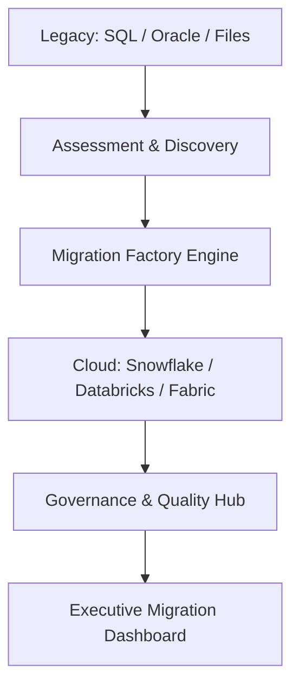

### 2. Detailed Component Topology
The internal service boundaries and management layers of the factory.

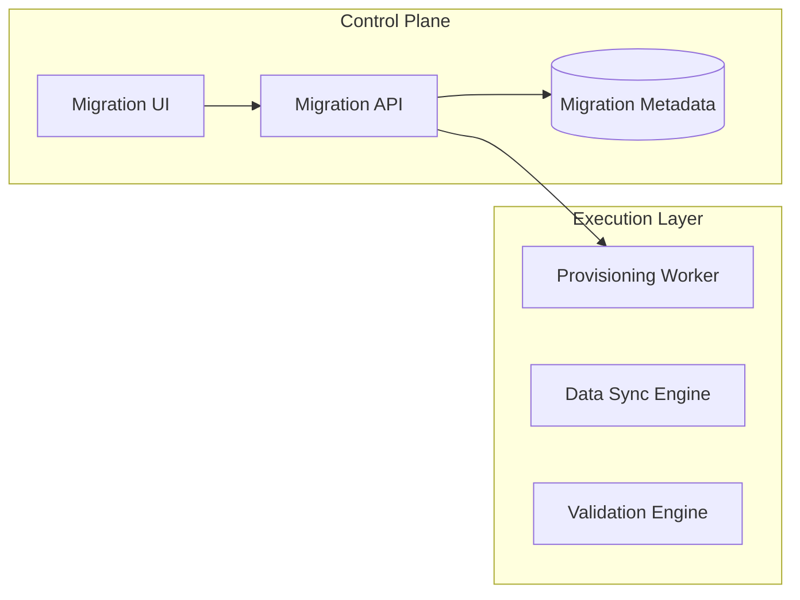

### 3. Frontend to Backend Request Path
Tracing a "Run Migration Job" request through the platform.

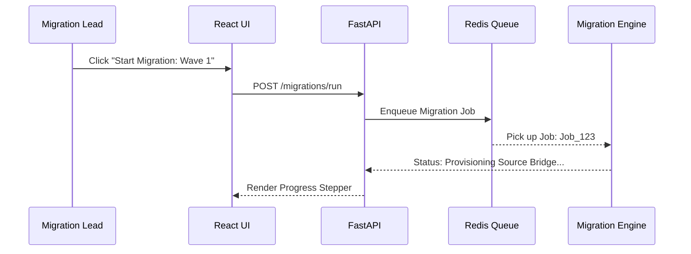

### 4. Migration Control Plane
Centralized orchestration for multi-cloud migration activities.

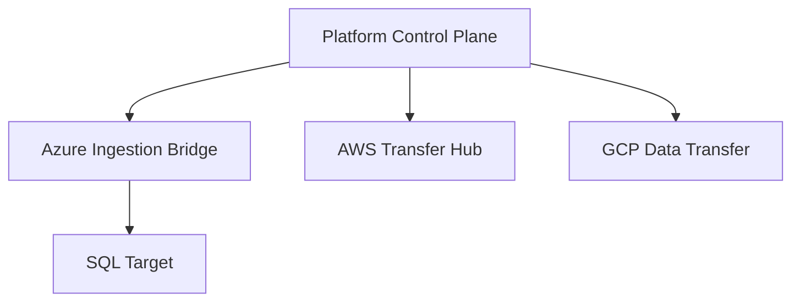

### 5. Multi-Cloud Target Topology
Standardizing the migration targets across major clouds.

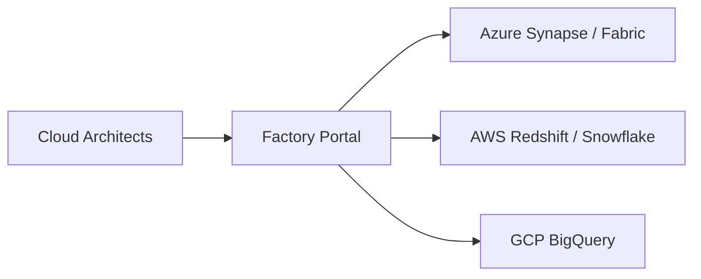

### 6. Regional Deployment Model
Localizing migration infrastructure for latency and sovereignty.

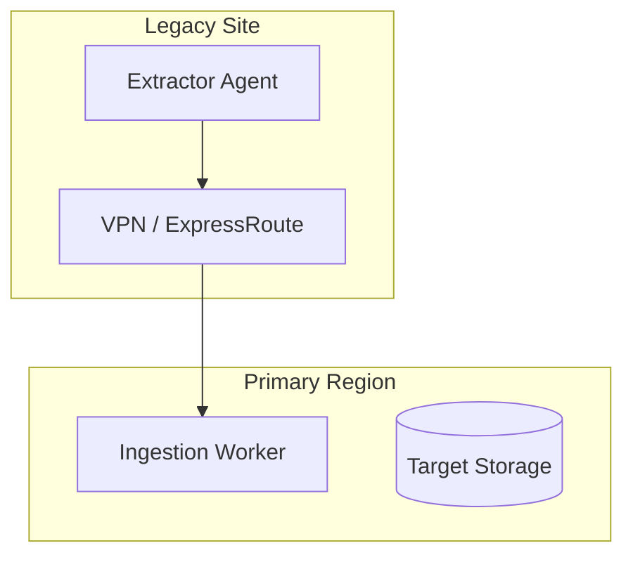

### 7. DR Failover Model
Ensuring migration continuity during platform outages.

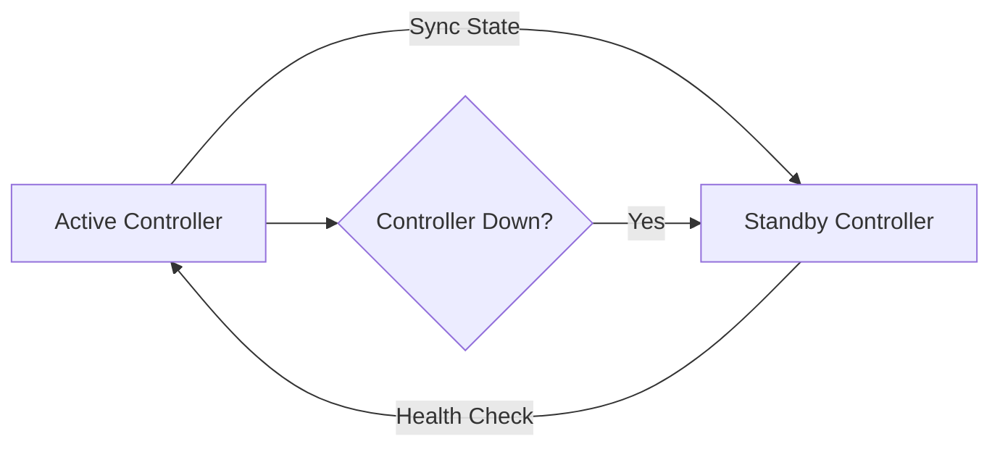

### 8. API Gateway Architecture
Securing the entry point for migration orchestration.

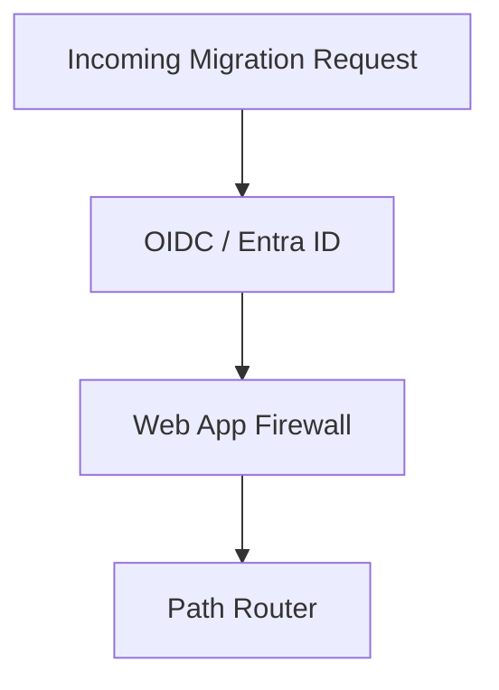

### 9. Queue Worker Architecture
Managing long-running migration and validation tasks.

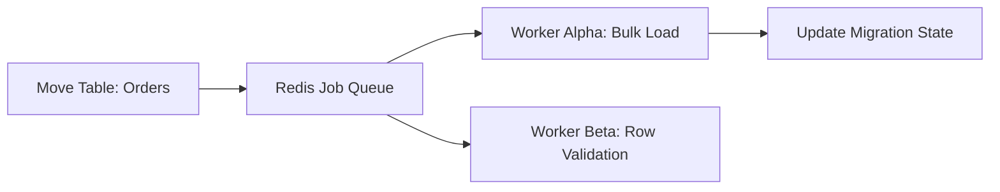

### 10. Dashboard Analytics Flow
How raw migration signals become executive migration scorecards.

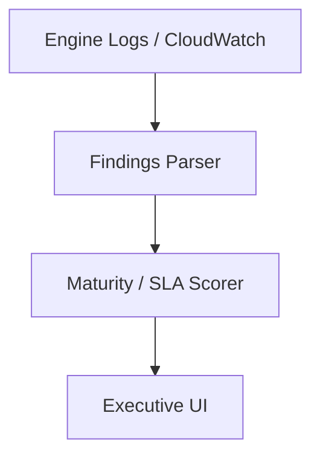

### 11. Source Inventory Workflow
Automated scanning of the legacy estate.

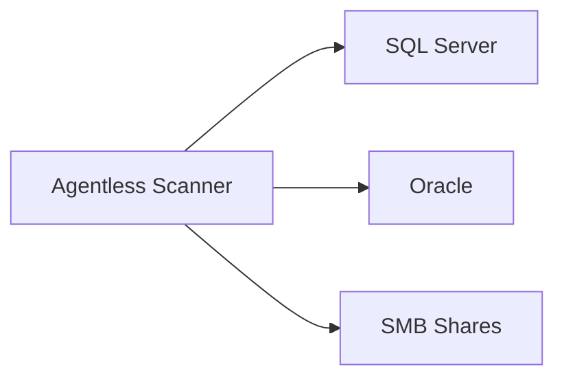

### 12. Dependency Discovery Model
Mapping application-to-database relationships.

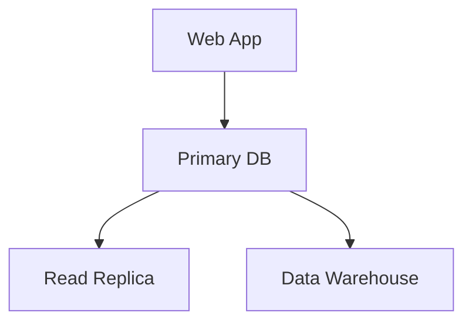

### 13. Application to Database Mapping
Visualizing the business impact of a migration unit.

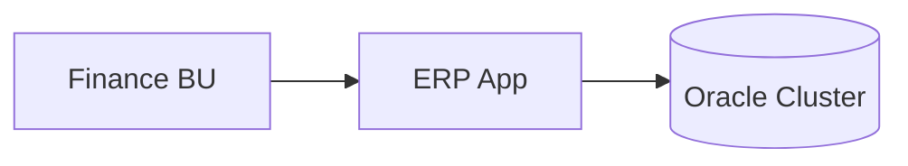

### 14. Data Classification Pre-check
Identifying PII/PHI before movement.

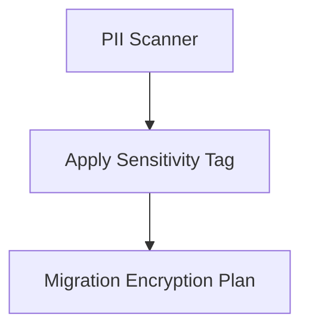

### 15. Readiness Scoring Flow
Quantifying the ease of migration for a source.

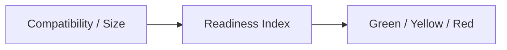

### 16. Target Platform Recommendation
Logic-based mapping of source to modern target.

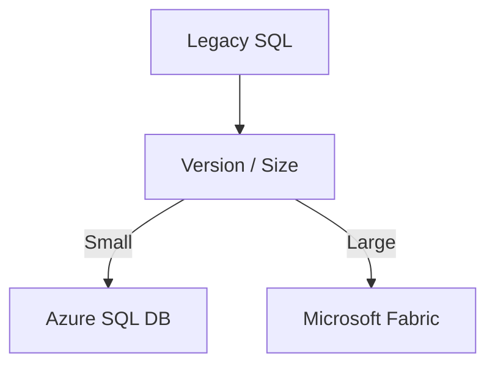

### 17. TCO Comparison Workflow
Analyzing the financial benefit of migration.

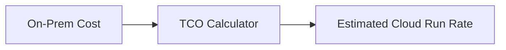

### 18. Risk Heatmap Generation
Visualizing migration danger zones.

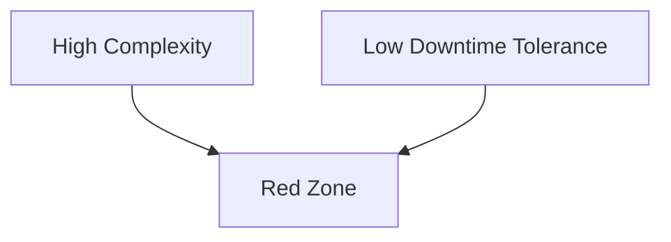

### 19. Wave Grouping Model
Bundling assets for migration efficiency.

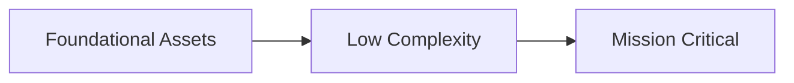

### 20. Stakeholder Approval Flow
Governing the "Go/No-Go" decision for a wave.

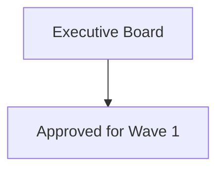

### 21. Schema Conversion Lifecycle
Automated translation of legacy DDL to cloud-native.

```mermaid
graph LR
    T_SQL[T-SQL] --> Converter[SCT Engine]
    Converter --> PL_PGSQL[PL/pgSQL]
```

### 22. Full Load Migration Flow
Executing the initial bulk data movement.

```mermaid
graph TD
    Source[Legacy DB] --> BCP[Bulk Copy]
    BCP --> Cloud[S3 / Blob Storage]
    Cloud --> Load[Target Load]
```

### 23. Incremental Sync Workflow
Keeping target in sync during long-running migrations.

```mermaid
graph LR
    Source[Updates] --> Sync[Incremental Logic]
    Sync --> Target[Target Sync]
```

### 24. CDC Replication Model
Near real-time change data capture for cutover readiness.

```mermaid
graph TD
    DB[Source] --> Logs[Transaction Logs]
    Logs --> CDC[CDC Agent]
    CDC --> Cloud[Target: Delta / Iceberg]
```

### 25. Near-zero Downtime Cutover
Switching application traffic with minimal impact.

```mermaid
sequenceDiagram
    App->>Source: Stop Writes
    Source->>Target: Final Sync
    App->>Target: Update Conn String
    App->>Target: Resume Writes
```

### 26. File Migration Factory Flow
Orchestrating petabyte-scale file transfers.

```mermaid
graph LR
    Share[SMB Share] --> Agent[DataBox / Transfer Agent]
    Agent --> Bucket[Cloud Bucket]
```

### 27. ETL Pipeline Migration Model
Modernizing legacy SSIS/Informatica to dbt/Spark.

```mermaid
graph TD
    SSIS[Legacy ETL] --> Logic[Extract Logic]
    Logic --> dbt[Modern dbt Model]
```

### 28. Warehouse to Lakehouse Migration
Migrating from fixed warehouses to open architectures.

```mermaid
graph LR
    Redshift[Redshift] --> Parquet[Parquet S3]
    Parquet --> Databricks[Databricks Delta]
```

### 29. Rollback Strategy Workflow
Automated recovery if cutover fails.

```mermaid
graph TD
    Fail[Migration Failed] --> Trigger[Trigger Rollback]
    Trigger --> Point[Point-in-time Restore]
```

### 30. Hypercare Support Lifecycle
Post-migration monitoring and stabilization.

```mermaid
graph LR
    GoLive[Live] --> Monitor[24/7 Watch]
    Monitor --> Handover[Operational Handover]
```

### 31. Row Count Reconciliation
Ensuring every record arrived safely.

```mermaid
graph LR
    S_Count[Source: 1M Rows] --> Compare[Val Engine]
    T_Count[Target: 1M Rows] --> Compare
```

### 32. Checksum Validation Flow
Verifying bit-for-bit data integrity.

```mermaid
graph TD
    Source[Source Block] --> Hash[MD5/SHA]
    Hash --> Target[Compare Target Hash]
```

### 33. Query Parity Testing
Validating that results match across source and target.

```mermaid
graph LR
    SQL[SELECT Sum(Rev)] --> Source[Result: 50K]
    SQL --> Target[Result: 50K]
```

### 34. Performance Benchmark Model
Comparing latency and throughput post-migration.

```mermaid
graph TD
    Pre[On-Prem P99: 120ms] --> Compare[Perf Engine]
    Post[Cloud P99: 45ms] --> Compare
```

### 35. Data Quality Rule Workflow
Enforcing DQ standards during movement.

```mermaid
graph LR
    Data[Record] --> Rule[Email Validator]
    Rule -->|Fail| Quarantine[Audit Table]
```

### 36. UAT Signoff Lifecycle
Business user validation of the new environment.

```mermaid
graph TD
    UAT[User Testing] --> Defects[Fix Issues]
    Defects --> Approve[Final Signoff]
```

### 37. Defect Remediation Workflow
Managing issues found during validation.

```mermaid
graph LR
    Bug[Mismatch Found] --> Ticket[Jira Ticket]
    Ticket --> Fix[Sync Logic Update]
```

### 38. SLA Acceptance Model
Verifying the target meets business SLAs.

```mermaid
graph TD
    Target[Target System] --> Test[Load Test]
    Test --> Pass[Meets 500ms SLA]
```

### 39. Compliance Evidence Workflow
Gathering audit artifacts for the transition.

```mermaid
graph LR
    Logs[Validation Logs] --> Report[SOX Evidence Package]
```

### 40. Final Go-Live Gate
The definitive check before decommissioning source.

```mermaid
graph TD
    Quality[DQ Check] --> Gate[Go/No-Go]
    SLA[SLA Check] --> Gate
    Signoff[Exec Signoff] --> Gate
```

### 41. SQL to PostgreSQL Migration
Targeting open-source agility.

```mermaid
graph LR
    SQL[SQL Server] --> SCT[Schema Tool]
    SCT --> PG[PostgreSQL]
```

### 42. Oracle to Cloud Database Model
Moving to managed SQL or Aurora.

```mermaid
graph TD
    Oracle[Oracle RAC] --> DMS[AWS DMS / Azure Migrate]
    DMS --> Aurora[Amazon Aurora]
```

### 43. SQL to Snowflake Flow
Modernizing to a SaaS warehouse.

```mermaid
graph LR
    SQL[SQL Server] --> S3[Stage in S3]
    S3 --> Snowflake[Copy Into Snowflake]
```

### 44. SQL to Databricks Flow
Moving to an open lakehouse.

```mermaid
graph LR
    SQL[SQL Server] --> ADF[Data Factory]
    ADF --> Delta[Delta Lake / Databricks]
```

### 45. SQL to BigQuery Flow
Cloud-native analytics at scale.

```mermaid
graph LR
    SQL[SQL Server] --> BQ_Transfer[BigQuery Data Transfer]
    BQ_Transfer --> BQ[BigQuery]
```

### 46. SQL to Synapse Flow
Enterprise scale on Azure.

```mermaid
graph LR
    SQL[SQL Server] --> Polybase[Polybase / ADF]
    Polybase --> Synapse[Synapse Pool]
```

### 47. On-prem File Share to Object Storage
Moving unstructured data to the cloud.

```mermaid
graph TD
    SMB[SMB Share] --> DataBox[Azure DataBox]
    DataBox --> Blob[Azure Blob Storage]
```

### 48. Hadoop to Lakehouse Model
Retiring complex Hadoop clusters.

```mermaid
graph LR
    HDFS[HDFS Data] --> Distcp[DistCp / WANdisco]
    Distcp --> Lakehouse[Cloud Lakehouse]
```

### 49. Legacy ETL to dbt Model
Modernizing transformation logic.

```mermaid
graph TD
    StoredProc[SQL Sproc] --> SQL_Mesh[SQL Mesh / dbt]
    SQL_Mesh --> Gold[Gold Tables]
```

### 50. Multi-target Coexistence Model
Running hybrid during transition.

```mermaid
graph LR
    App[App] --> Router[Data Router]
    Router --> Source[Legacy]
    Router --> Target[Modern]
```

### 51. OIDC / SSO Auth Flow
Securing the factory platform.

```mermaid
sequenceDiagram
    User->>Portal: Login
    Portal->>AzureAD: Auth
    AzureAD-->>User: Token
```

### 52. RBAC Model
Granular migration permissions.

```mermaid
graph TD
    Role[Migration Lead] --> Grant[Full Control]
    Role[Validator] --> Grant[Read + Validation]
```

### 53. Secrets Management Flow
Securing credentials for source and target.

```mermaid
graph LR
    Job[Sync Job] --> KV[Key Vault / Secret Mgr]
```

### 54. Audit Logging Architecture
Immutable records of every row moved.

```mermaid
graph TD
    Action[Data Move] --> Store[(Immutable Audit Log)]
```

### 55. Metrics Pipeline
Real-time migration velocity tracking.

```mermaid
graph LR
    Logs[Engine Logs] --> Prom[Prometheus]
    Prom --> Grafana[Mig Board]
```

### 56. Logging Architecture
Centralized logs for distributed workers.

```mermaid
graph TD
    WorkerA[Azure Worker] --> Splunk[Splunk Cloud]
    WorkerB[AWS Worker] --> Splunk
```

### 57. Tracing Model
Tracing complex multi-step migration jobs.

```mermaid
sequenceDiagram
    Portal->>Job: Trigger Move
    Job->>Source: Extract
    Job->>Target: Load
```

### 58. Executive KPI Review Cycle
Reporting migration progress to the board.

```mermaid
graph LR
    Stats[Migration %] --> Meeting[Weekly Exec Review]
```

### 59. Change Approval Workflow
Managing the migration schedule.

```mermaid
graph TD
    Req[Wave 2 Start] --> CAB[Change Advisory Board]
    CAB --> Approved[Update Schedule]
```

### 60. Release Pipeline Workflow
Continuous delivery of the migration platform.

```mermaid
graph LR
    Git[Code Push] --> GHA[GitHub Actions]
    GHA --> AKS[Deploy Engine]
```

---

## 🔬 Data Migration Factory Methodology

### 1. The Migration Strategy Pillars
We standardize our approach using the "Five Rs" of modernization:
- **Rehost**: Lift-and-shift to managed infrastructure.
- **Replatform**: Move to cloud-native database services with minimal changes.
- **Refactor**: Modernize data structures to Delta Lake or Iceberg.
- **Replace**: Transition from legacy ETL to SaaS analytics products.
- **Retire**: Identifying and decommissioning redundant data assets.

### 2. Validation & Reconciliation framework
Migration without validation is just data corruption. Our platform enforces:
- **Structural Validation**: Ensuring schemas, indexes, and constraints match.
- **Quantitative Validation**: Bit-for-bit checksums and row count audits.
- **Qualitative Validation**: Query parity testing against business-critical reports.

---

## 🚦 Getting Started

### 1. Prerequisites
- **Terraform** (v1.5+).
- **Docker Desktop**.
- **Azure/AWS/GCP CLI** configured.

### 2. Local Setup
```bash
# Clone the repository
git clone https://github.com/Devopstrio/data-migration-factory.git
cd data-migration-factory

# Start the Migration Control Plane
docker-compose up --build
```
Access the Factory Portal at `http://localhost:3000`.

---

## 🛡️ Governance & Security
- **Encryption at Flight**: All migration traffic is encrypted via TLS 1.3 and private peering (ExpressRoute/Direct Connect).
- **Immutable Auditability**: Every data movement, user action, and validation result is recorded in an immutable audit store.
- **Zero-Trust Migration**: Source and target credentials are never stored locally and are managed via enterprise secret managers.

---
<sub>&copy; 2026 Devopstrio &mdash; Engineering the Future of Industrialized Cloud Modernization.</sub>
