<div align="center">


<h1>Data Migration Factory</h1>

<p><strong>The Institutional-Grade Platform for Standardized Data Modernization Foundations, Migration Governance, and Multi-Cloud Modernization Ecosystems.</strong></p>

[]()
[]()
[]()

<br/>

> **"Industrializing data modernization to automate migration foundations."** 
> **Data Migration Factory** is an enterprise-grade platform designed to provide a secure, measurable, and highly automated foundation for global data modernization operations. It orchestrates the complex lifecycle of migrations—from source discovery and schema conversion to high-throughput data sync and unified cutover auditing.

</div>

---

## 🏛️ Executive Summary

Fragmented legacy data estates and manual migration workflows are strategic operational liabilities; lack of centralized migration orchestration is a primary barrier to organizational cloud maturity. Organizations fail to maintain a high-performing modernization culture not because of a lack of tools, but because of fragmented migration standards, lack of automated validation, and an inability to orchestrate modernization planes with operational precision.

This platform provides the **Migration Intelligence Plane**. It implements a complete **Data-Migration-Factory-as-Code Framework**, enabling Transformation Leaders and Migration teams to manage global modernization foundations as first-class citizens. By automating the identification of migration bottlenecks through real-time telemetry analysis and orchestrating the provisioning of secure performance-driven migration policies, we ensure that every organizational asset—from legacy SQL clusters to distributed file shares—is migrated by default, audited for history, and strictly aligned with institutional modernization frameworks.

---

## 📐 Architecture Storytelling: Principal Reference Models

### 1. Principal Architecture: Global Data Migration Factory & Migration Intelligence Plane
This diagram illustrates the end-to-end flow from source telemetry ingestion and multi-cloud orchestration to migration enforcement, performance validation, and institutional modernization auditing.

```mermaid
graph LR
    %% Subgraph Definitions
    subgraph SourceIngress["Legacy Estate & Metadata Ingress"]
        direction TB
        Databases["SQL / Oracle / DB2 Clusters"]
        Unstructured["SMB Shares / HDFS / S3"]
        ETL_Logic["SSIS / Informatica / Procedures"]
    end

    subgraph IntelligenceEngine["Migration Intelligence Hub"]
        direction TB
        API["FastAPI Migration Gateway"]
        MigrationOrchestrator["Global Wave & Cutover Hub"]
        Governance_Hub["Compliance & Guardrail Hub"]
        AIOps_Validator["Risk & Anomaly Analysis Hub"]
    end

    subgraph OperationsPlane["Distributed Modernization Ecosystem"]
        direction TB
        MigrationBridges["Managed Migration Ingress Bridges"]
        ActivePipelines["Managed Automated Sync Pipelines"]
        TargetSinks["Managed Infrastructure Target Hubs"]
    end

    subgraph OperationsHub["Institutional Modernization Hub"]
        direction TB
        Scorecard["Migration Maturity Scorecard"]
        Analytics["Modernization Flow & Cutover Stats"]
        Audit["Forensic Migration Metadata Lake"]
    end

    subgraph DevOps["Data-Migration-Factory-as-Code Framework"]
        direction TB
        TF["Terraform Migration Modules"]
        DriftBot["Readiness & Config Drift Validator"]
        ChatOps["Migration Operations Hub"]
    end

    %% Flow Arrows
    SourceIngress -->|1. Submit Discovery| API
    API -->|2. Orchestrate Migration| MigrationOrchestrator
    MigrationOrchestrator -->|3. Apply Security Guard| Governance_Hub
    Governance_Hub -->|4. Assess Drift| AIOps_Validator
    
    AIOps_Validator -->|5. Execute Sync| OperationsPlane
    OperationsPlane -->|6. Notify Status| ChatOps
    API -->|7. Visualize Health| Scorecard
    
    Scorecard -->|8. Track Maturity| Analytics
    Scorecard -->|9. Record Performance| Audit
    
    TF -->|10. Provision Backbone| IntelligenceEngine
    DriftBot -->|11. Inject Cutover Risk| MigrationOrchestrator
    Audit -->|12. Improve Operations| MigrationBridges

    %% Styling
    classDef ingress fill:#f5f5f5,stroke:#616161,stroke-width:2px;
    classDef intel fill:#e8eaf6,stroke:#1a237e,stroke-width:2px;
    classDef operations fill:#e1f5fe,stroke:#01579b,stroke-width:2px;
    classDef ops fill:#ede7f6,stroke:#311b92,stroke-width:2px;
    classDef devops fill:#e8f5e9,stroke:#1b5e20,stroke-width:2px;

    class SourceIngress ingress;
    class IntelligenceEngine intel;
    class OperationsPlane operations;
    class OperationsHub ops;
    class DevOps devops;
```

### 2. The Migration Lifecycle Flow
The continuous path of a data migration platform from initial integration (discovery) and aggregation (readiness) to active analysis (risk), optimization (sync), and institutional forensic auditing (scorecard).

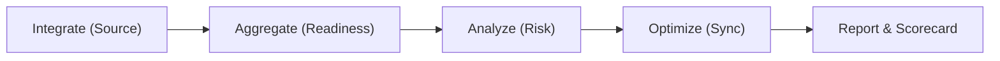

### 3. Distributed Migration Telemetry Topology
Strategically orchestrating standardized migration across global data centers, diverse legacy sites, and multi-cloud targets, providing a unified institutional view of global modernization health and operational readiness.

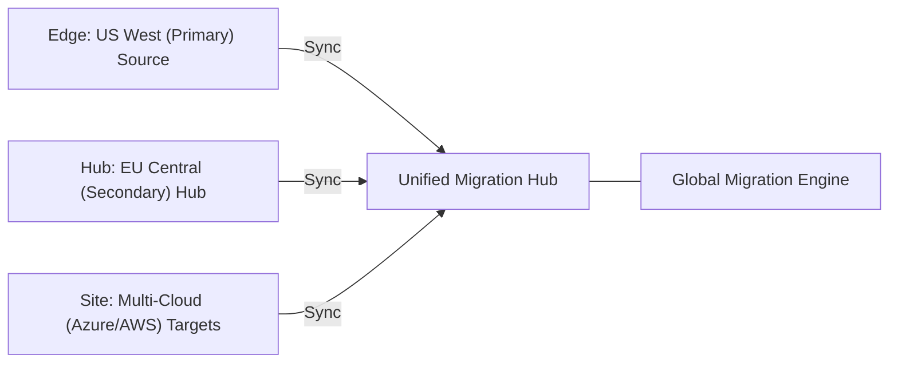

### 4. Migration Governance & High-Trust Data Plane Protection Flow
Executing complex logic for securing the bridge between legacy systems and modern targets, ensuring every organizational identity is verified, data-at-rest is encrypted, and every migration access is according to institutional standards.

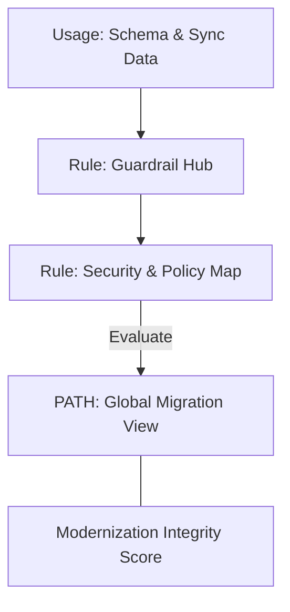

### 5. Multi-Region Migration Federation & Governance Flow
Automatically managing unified modernization standards across global regions and diverse business units, ensuring institutional data residency and security boundaries by default.

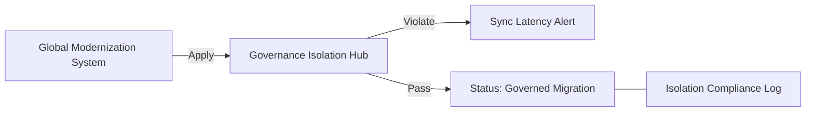

### 6. Encryption & Perimeter Protection Flow (Migration Standard)
Managing the lifecycle of a synchronization request, automatically enforcing institutional TLS 1.3 and resource encryption standards as required by security policy, ensuring zero-latency security confidence.

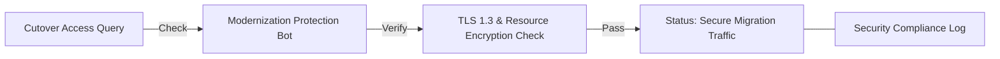

### 7. Institutional Migration Maturity Scorecard
Grading organizational performance based on key indicators: Cutover Success Rate, Schema Compatibility Index, and Zero-Downtime Adoption Scores.

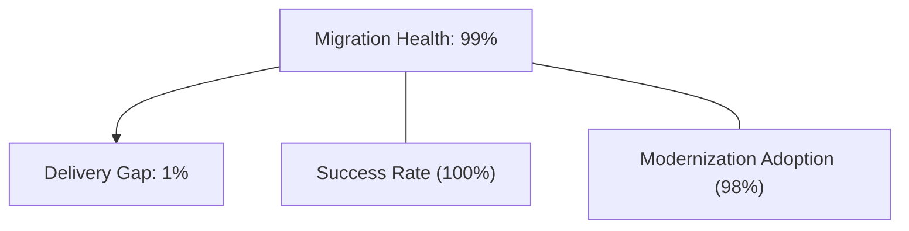

### 8. Identity & RBAC for Migration Governance
Managing fine-grained access to migration hubs, provisioning workers, and audit logs between CTOs, Migration Managers, and Engineers.

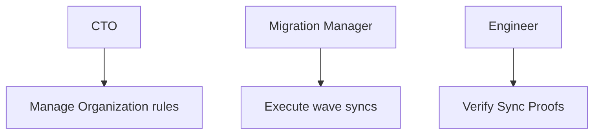

### 9. IaC Deployment: Data-Migration-Factory-as-Code Framework
Using modular Terraform to deploy and manage the versioned distribution of the migration tracking hubs, sync protection workers, and forensic metadata lakes.

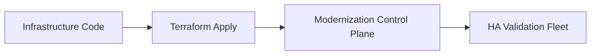

### 10. AIOps Migration Drift & Risk Validation Flow
Using advanced analytics to identify sudden surges in sync latency, unauthorized schema changes, suspicious configuration drifts, or unusual cutover pattern changes that could result in institutional risk or data loss.

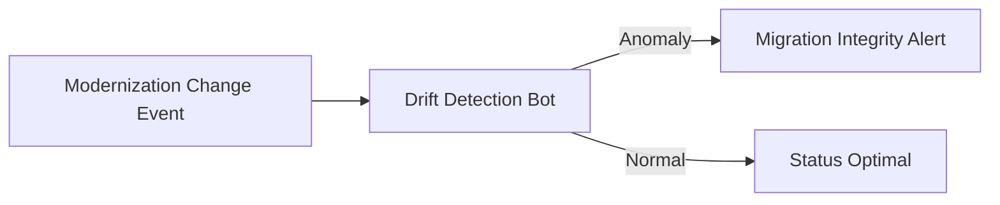

### 11. Metadata Lake for Forensic Migration Audit
Storing long-term records of every source integration event (metadata), every cutover executed, and every schema version history for institutional record-keeping, compliance auditing, and post-provisioning forensics.

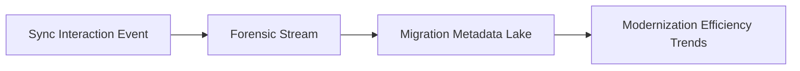

---

## 🏛️ Core Governance Pillars

1.  **Unified Foundation Coordination**: Maximizing resilience by centralizing all modernization measurement through a single institutional plane.
2.  **Automated Migration Provisioning**: Eliminating "manual cutover" scenarios through proactive orchestration and pattern verification.
3.  **Sequential Wave Intelligence**: Ensuring zero-interruption operations through dependency-aware wave-driven modernization engineering.
4.  **Zero-Trust Data Protection**: Automatically enforcing identity-based access, data-at-rest encryption, and policy evaluation across all migration tiers.
5.  **Autonomous Operations Logic**: Guaranteeing reliability through automated industry-specific modernization monitoring runbooks.
6.  **Full Migration Auditability**: Immutable recording of every sync change and migration provision for institutional forensics.

---

## 🛠️ Technical Stack & Implementation

### Modernization Engine & APIs
*   **Framework**: Python 3.11+ / FastAPI.
*   **Performance Engine**: Custom Python-based logic for multi-cloud source ingestion and DORA-style migration metrics.
*   **Integrations**: Native connectors for SQL Server, Oracle, Snowflake, Databricks, and Fabric APIs.
*   **Persistence**: PostgreSQL (Migration Ledger) and Redis (Live Sync State).
*   **Auth Orchestrator**: Federated OIDC/SAML for least-privilege migration management access.

### Governance Dashboard (UI)
*   **Framework**: React 18 / Vite.
*   **Theme**: Dark, Slate, Indigo (Modern high-fidelity modernization aesthetic).
*   **Visualization**: D3.js for migration topologies and Recharts for readiness velocity analytics.

### Infrastructure & DevOps
*   **Runtime**: AWS EKS or Azure Kubernetes Service (AKS) for management plane.
*   **Migration Hub**: Managed event sourcing for immutable modernization timeline reconstruction.
*   **IaC**: Modular Terraform for deploying the migration landing zone and validation fleet.

---

## 🏗️ IaC Mapping (Module Structure)

| Module | Purpose | Real Services |
| :--- | :--- | :--- |
| **`infrastructure/migration_hub`** | Central management plane | EKS, PostgreSQL, Redis |
| **`infrastructure/enforcers`** | Distributed migration provisioners | Azure, AWS, GCP APIs |
| **`infrastructure/sync_pipes`** | Data Ingestion Hubs | Webhooks, Lambda |
| **`infrastructure/auditing`** | Forensic modernization sinks | S3, Athena, Quicksight |

---

## 🚀 Deployment Guide

### Local Principal Environment
```bash
# Clone the Data Migration Factory repository
git clone https://github.com/devopstrio/data-migration-factory.git
cd data-migration-factory

# Configure environment
cp .env.example .env

# Launch the Modernization stack
make init

# Trigger a mock migration update and automated readiness validation simulation
make simulate-migration
```

Access the Management Portal at `http://localhost:3000`.

---

## 📜 License
Distributed under the MIT License. See `LICENSE` for more information.

---
<div align="center">
  <p>© 2026 Devopstrio. All rights reserved.</p>
</div>
